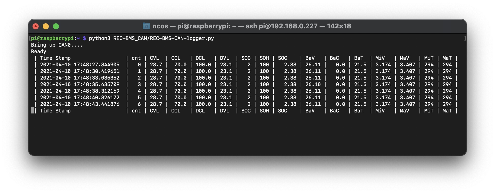

# Reading CANBus Messages from the REC Q (Victron Compatible Firmware)

This python script will read and interpret CAN messages from the REC Q Battery Management System.

## Recommended Hardware

This was written to run on a Raspberry Pi using a CAN interface like the [PiCAN3](https://copperhilltech.com/pican3-can-bus-board-for-raspberry-pi-4-with-3a-smps-and-rtc/) hat.

## Dependancies

can-utils: `apt-get install can-utils`

python-can: `pip install python-can`

The **Dockerfile** will produce a container with these dependancies to allow the script to run on a non-pi host, though it will not be able to access any CAN data:

`docker build -t my-python-container -f docker/Dockerfile .`

`docker run -it --rm -v "$PWD":/project -w /project my-python-container python REC-BMS-CAN-logger.py` 

## Use

` git clone https://github.com/natecostello/REC-BMS_CAN.git`

`python3 REC-BMS_CAN/REC-BMS-CAN-logger.py`

## Sample Output

